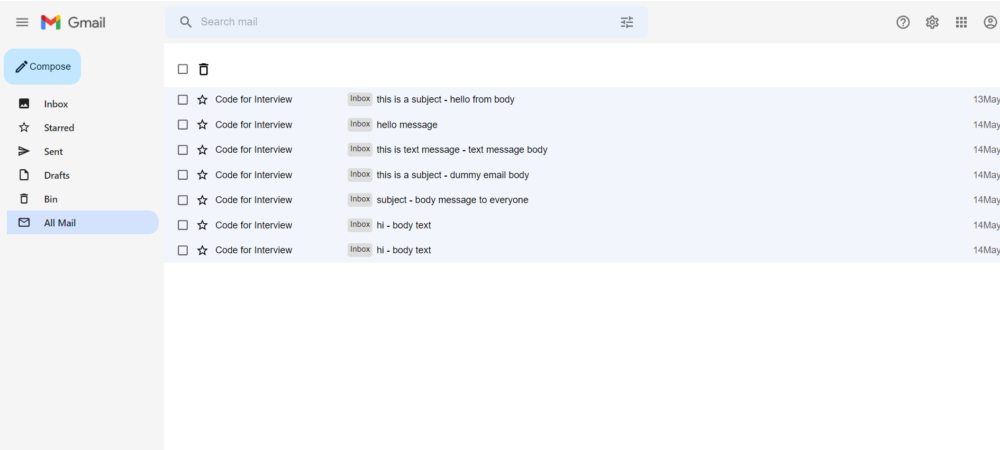

## Description:

 Design and develop an Application using the full-stack.

 ## Project Title:
 Gmail Clone

 ## Project Folder Name:client(Frontend code)

 To run this code

 > cd client

 > npm start

 ## Project Description:
 Sketch the layout of your application 's interface,focusing on usability and user experience .Use CSS frameworks like Bootstrap for a responsive design that adapts to various screen sizes.

 ## Tech Stacks:
  -  Frount-end:Reactjs
  - Back-end:Nodejs
  - Database:MongoDB

  ### Frontend Project Folder:Gmail-Clone-Client

  ## Getting Started with Create React App
   
  This project was bootstrapped with `Create React App`

  ## Run the code in the terminal

  foldername > `npm start`

  Runs the app in the development mode.

  Open http://localhost:3000 to view it in browser

  The page will reload if you make edits.

  You will also see any lint errors in the console.

  ### Components:
  - ComposeMail.jsx

      In this file the compose dialog box feature is coded 

      
  - Email.jsx
  - Emails.jsx
  - Header.jsx
  - SideBar.jsx
  - SideBarContent.jsx
  - ViewEmai.jsx
   
   ### Components inside Folder:
   #### Common
 -ErrorComponent.jsx
 - NoMails.jsx
 - SuspenseLoader.jsx

 #### Config
 - sidebar.config.js

 In this file the sidebar content is created 

  
 #### hooks
 - useApi.jsx
 #### pages
 - Main.jsx
 #### routes
 - routes.js

 In this file the routing has been done ,url routing
 #### services
 - api.js
 - api.urls.js

 In this file database method is created using function,sidebar content method and endpoint is created.

 ## App.js File

 Overall code routes is navigate from this file

## Output Screenshot:

 ### List of All Mail message.

  

### List of sent message
  
  

### List of Starred message

  
  

###  List of drafts message
  
  

###  List of bin message

  

###  Inbox message 

  
  

###  List of selected particular message

  
  

### List of selecting all message
  
  

### View message Body

  
  

